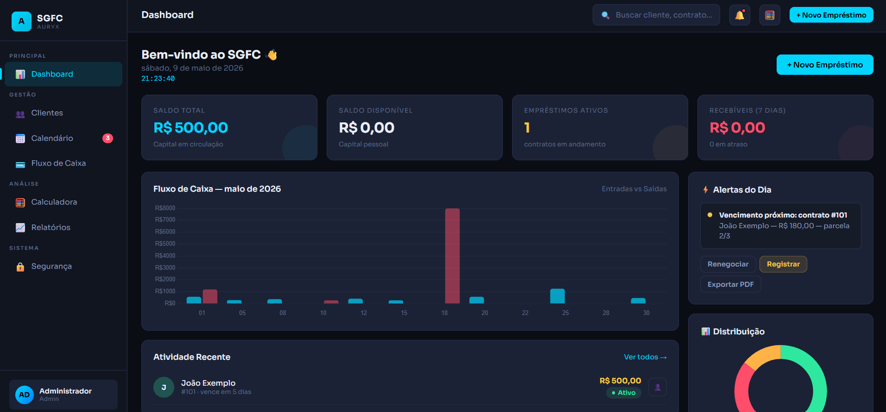

# ✨ SGFC — Sistema de Gestão Financeira para Credores

Plataforma moderna de gestão financeira desenvolvida para controle completo de empréstimos, clientes, recebimentos e fluxo de caixa.  
O projeto oferece uma experiência visual premium inspirada em dashboards profissionais, focando em produtividade, organização financeira e análise estratégica de crédito.

---

## 🌐 Live Demo

👉 [Acessar projeto](COLE_AQUI_SEU_LINK_DO_NETLIFY)

---

## 📷 Preview

---

## 🎯 Objetivo

Centralizar toda a operação de gestão financeira de credores em uma interface moderna, intuitiva e altamente visual, permitindo:

- Controle de clientes
- Gestão de empréstimos
- Monitoramento de pagamentos
- Fluxo de caixa inteligente
- Relatórios financeiros
- Simulações de juros
- Alertas e notificações
- Administração segura do sistema

Tudo isso em uma experiência fluida, responsiva e inspirada em softwares SaaS premium.

---

## 🚀 O que o sistema oferece

- Dashboard financeiro completo
- Controle de empréstimos
- Gestão detalhada de clientes
- Registro e acompanhamento de pagamentos
- Fluxo de caixa em tempo real
- Sistema de notificações
- Calendário financeiro
- Relatórios inteligentes
- Calculadora de juros
- Controle de status dos contratos
- Histórico de atividades
- Sistema de autenticação
- Interface administrativa
- Estrutura modular escalável
- Experiência responsiva para desktop e mobile

---

## 📊 Funcionalidades principais

### 📈 Dashboard Inteligente

O sistema possui um painel administrativo completo com:

- Métricas financeiras
- Saldo total em circulação
- Empréstimos ativos
- Recebíveis próximos
- Alertas financeiros
- Distribuição de clientes
- Gráficos dinâmicos
- Fluxo de caixa mensal
- Atividades recentes

---

### 👥 Gestão de Clientes

- Cadastro de clientes
- Edição de informações
- Exclusão de registros
- Perfil detalhado
- Histórico financeiro
- Controle de status:
  - Ativo
  - Em atraso
  - Renegociando
- Visualização individual de contratos
- Timeline financeira completa

---

### 💳 Gestão de Empréstimos

- Criação de novos empréstimos
- Sistema multi-etapas
- Controle de parcelas
- Taxas personalizadas
- Juros compostos e simples
- Status de contratos
- Histórico de pagamentos
- Acompanhamento de saldo pendente
- Simulações financeiras

---

### 📅 Calendário Financeiro

- Organização de vencimentos
- Eventos financeiros
- Alertas visuais
- Controle de atrasos
- Indicadores por status
- Gestão de recebimentos futuros

---

### 🧮 Calculadora Financeira

Simulador completo de juros com:

- Juros compostos
- Juros simples
- Taxas diárias
- Taxas mensais
- Taxas anuais
- Simulação de parcelas
- Projeções financeiras

---

### 📊 Relatórios e Analytics

- Relatórios financeiros
- Indicadores estratégicos
- Visualização gráfica
- Insights operacionais
- Controle de performance
- Histórico de movimentações

---

### 🔒 Segurança e Administração

- Tela de login moderna
- Controle administrativo
- Estrutura de permissões
- Logs do sistema
- Controle de usuários
- Interface segura
- Organização por módulos

---

## 🎨 Design e Experiência

O projeto utiliza uma identidade visual moderna com:

- Dark UI premium
- Glassmorphism leve
- Layout inspirado em fintechs
- Sidebar administrativa
- Cards interativos
- Interface minimalista
- Microinterações
- Sistema visual profissional
- Feedbacks visuais dinâmicos
- Componentização visual

---

## 🛠 Tecnologias utilizadas

- HTML5
- CSS3
- JavaScript Vanilla
- Chart.js
- Responsive Design
- CSS Variables
- Flexbox
- CSS Grid
- UI/UX moderna
- Estrutura SPA (Single Page Application)

---

## 📱 Responsividade

O sistema foi desenvolvido com adaptação responsiva para:

- Desktop
- Tablets
- Smartphones

Garantindo uma navegação fluida em diferentes tamanhos de tela.

---

## ✨ Características do projeto

- Interface extremamente moderna
- Dashboard profissional
- Sistema altamente visual
- Estrutura organizada
- Navegação intuitiva
- Componentes reutilizáveis
- Experiência imersiva
- Arquitetura escalável
- Fácil manutenção
- Código modular
- Visual inspirado em sistemas enterprise

---

## 📚 Inspirações e referências

- Fintech Dashboards
- Banking Systems
- SaaS Admin Panels
- Modern Financial Platforms
- Stripe Dashboard
- Notion UI
- Linear Design System
- Enterprise Financial Systems

---

## 📌 Status

🚧 Projeto em desenvolvimento contínuo.

Novas funcionalidades, melhorias visuais e integrações futuras estão sendo planejadas.

---

## 👩‍💻 Autor

Desenvolvido por Auryx como projeto de estudo, demonstração de interface moderna e construção de um sistema financeiro administrativo completo.